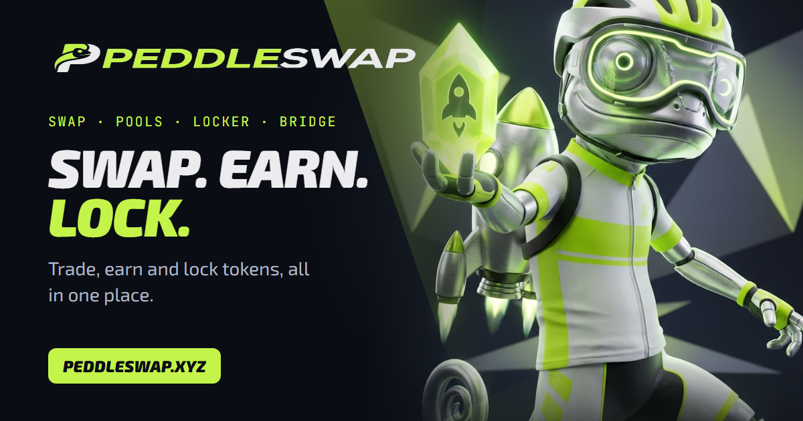

<h3 align="center">Swap. Earn. Lock.</h3>

  Trade any token at the best price, earn from every trade, and lock liquidity so everyone can see it's safe. 
  Live on <b>Robinhood Chain</b> and <b>Base</b>.

  <a href="https://peddleswap.xyz"><b>Open the app</b></a> ·
  <a href="https://docs.peddleswap.xyz">Docs</a> ·
  <a href="https://docs.peddleswap.xyz/contracts">Contracts</a> ·
  <a href="https://testnet.peddleswap.xyz">Testnet</a> ·
  <a href="https://peddleswap.xyz/brand">Brand kit</a> ·
  <a href="https://github.com/peddleswap/core-sdk">SDK</a>

  
  
  

---

## What you can do

<table>
  <tr>
    <td width="50%" valign="top">
      <h3><a href="https://peddleswap.xyz/swap">Swap</a></h3>
      Trade one token for another in a single step. PeddleSwap checks every V2 and V3 pool that could fill your trade and picks the one that gives you the most.
    </td>
    <td width="50%" valign="top">
      <h3><a href="https://peddleswap.xyz/pools">Pools</a></h3>
      Add two tokens to a pool and earn a share of the fee on every trade. Keep it simple with V2, or choose your own price range with V3. V3 pools also support dynamic fees.
    </td>
  </tr>
  <tr>
    <td width="50%" valign="top">
      <h3><a href="https://peddleswap.xyz/locker">Locker</a></h3>
      Lock tokens, LP tokens or a V3 position until a date you choose. Every lock is public, and nobody can unlock it early. Not even us.
    </td>
    <td width="50%" valign="top">
      <h3>Limit orders</h3>
      Set the price you want and let your order wait. It fills when the market gets there. Available on Base.
    </td>
  </tr>
  <tr>
    <td width="50%" valign="top">
      <h3><a href="https://peddleswap.xyz/bridge">Bridge</a></h3>
      Move assets between networks without leaving PeddleSwap. Sign once and watch your transfer arrive, live.
    </td>
    <td width="50%" valign="top">
      <h3><a href="https://peddleswap.xyz/analytics">Analytics</a></h3>
      Track volume, fees and liquidity over time, and see which pools are busiest right now. Every list shows all our networks together, each row marked with its chain's logo.
    </td>
  </tr>
  <tr>
    <td colspan="2" valign="top">
      <h3>Launchpad <i>coming soon</i></h3>
      Create your own token, open a market for it and lock the liquidity, all from one form. Coming soon on Robinhood Chain.
    </td>
  </tr>
</table>

## Networks

| Network | Chain ID | Status |
|---|---|---|
| [Robinhood Chain](https://docs.peddleswap.xyz/robinhood-chain) | 4663 | Live |
| [Base](https://docs.peddleswap.xyz/base) | 8453 | Live |
| Sepolia | 11155111 | Testnet at [testnet.peddleswap.xyz](https://testnet.peddleswap.xyz) |

Every contract's source code is published and verified, so anyone can read exactly what it does. On every network the contracts are owned by the same treasury, a Safe that needs two of three signers:
`0x715a6176946aDbD22c1B2021d321Fb3767ca3432`. All addresses, with explorer links, are on the [contracts page](https://docs.peddleswap.xyz/contracts).

## For developers

The PeddleSwap SDK is on GitHub: **[peddleswap/core-sdk](https://github.com/peddleswap/core-sdk)**. It has the addresses, ABIs and chain definitions for every PeddleSwap contract on every network, in TypeScript, built for [viem](https://viem.sh).

- **Building with Claude?** Hand it [CLAUDE-PROMPT.md](https://github.com/peddleswap/core-sdk/blob/main/CLAUDE-PROMPT.md) and it will know how to integrate PeddleSwap.
- **Contract addresses** for every network: [docs.peddleswap.xyz/contracts](https://docs.peddleswap.xyz/contracts)
- **Fees**, and the most each one can ever be: [docs.peddleswap.xyz/fees](https://docs.peddleswap.xyz/fees)

## New here?

1. Get a wallet such as MetaMask, Rabby or Coinbase Wallet.
2. Add a little ETH on Robinhood Chain or Base for network fees. The [Bridge](https://peddleswap.xyz/bridge) can move some over.
3. Open [peddleswap.xyz](https://peddleswap.xyz), press **Connect wallet**, and make your first swap.

Questions? The [help centre](https://docs.peddleswap.xyz) walks through everything in plain steps.

 

  

